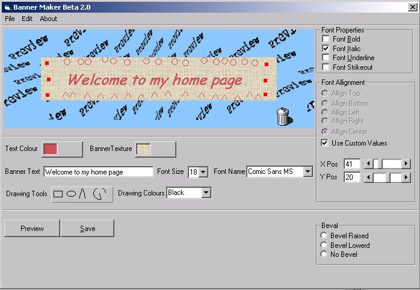



## Banner Maker Beta 2\.0

### Description

Hi Don't know if you all remmber the last Banner maker I make well anyway this one is much better that the last one with more option. you can now select what size of banner you want I have also added a new texture browser like in office 97 so you can change the backgound aslo added some small drawing tools as well . I will be updateing this program very soon and adding more options like save your banners to Jpeg or Gif

Well anyway have a look at the screen shot and Id like to know what you think. please Vote if you like this code.
 
### More Info
 

             |
---                |---
**Submitted On**   |2001-01-03 01:01:26
**By**             |[dreamvb](https://github.com/Planet-Source-Code/PSCIndex/blob/master/ByAuthor/dreamvb.md)
**Level**          |Intermediate
**User Rating**    |4.6 (23 globes from 5 users)
**Compatibility**  |VB 6\.0
**Category**       |[Complete Applications](https://github.com/Planet-Source-Code/PSCIndex/blob/master/ByCategory/complete-applications__1-27.md)
**World**          |[Visual Basic](https://github.com/Planet-Source-Code/PSCIndex/blob/master/ByWorld/visual-basic.md)
**Archive File**   |[CODE\_UPLOAD13255112001\.zip](https://github.com/Planet-Source-Code/dreamvb-banner-maker-beta-2-0__1-14021/archive/master.zip)

